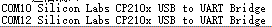
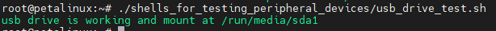

[Back to Home](../)
## Use the interfaces and peripherals on the development board in LINUX
---
-These interfaces and peripherals are available on the Z19-P development boards :\
\
①DP\
②ETH\
③PS_UART\
④PL_UART\
⑤USB TYPE-C\
⑥M.2
⑦EMMC(图中不可见)\
⑧EEPROM(图中不可见)\
⑨QSPI FLASH(图中不可见)\
⑩RTC(图中不可见)\
⑪LM75(图中不可见)\
PS : In the Linux system on the development board created earlier, I integrated some scripts in Path *~/shells_for_testing_peripheral_devices/* to test these interfaces and peripherals. You can also refer to these scripts to use these interfaces and peripherals :\


---
### ①DP
#### 1.1What is DP
DP (DisplayPort) interface is a digital video and audio interface standard used to connect computers, televisions, monitors, audio and other equipment. It is an open standard developed by Video Electronics Standards Association (VESA).\
There are two physical interfaces of DP interface, one is the standard DP interface in rectangular shape, and the other is the Mini DP interface in circular shape. The Mini DP interface is used on our development board.
#### 1.2Using DP in Linux
Connect DP to the display, and you can see the desktop of Macthbox after the system is started :\


---
### ②ETH
#### 2.1What is ETH
In the Linux operating system, \"ETH\" usually refers to the network interface device, which is the hardware device used to communicate between the computer and the network. In Linux, you can use the *ifconfig* command to manage and configure network interface devices. The development board and other network devices can be connected in the same network through the ETH interface for data transmission.\
In the Ethernet protocol, each device is assigned a unique MAC address for identification and communication in the network. When computers send data through network interface devices, they will be encapsulated in Ethernet frames and routed and transmitted using MAC addresses.
#### 2.2Using ETH in Linux
Connect ETH (such as through router or switch) to LAN :\
\
Then power on the development board, log in to the system, and use *ifconfig* to view the current ETH status :\
\
If your router or switch supports DHCP, both eth0 and eth1 will be automatically connected and be assigned an IP address.\
If no IP address is assigned, you need to use the following command to assign it manually, for example :\
`ifconfig eth0 192.168.8.67`\
The *ifconfig* command can also be used to set the subnet mask; If the MAC address needs to be modified, */etc/network/interfaces* needs to be modified; If you want to set the gateway, you need to use command **route**; If you need to modify DNS, you need to modify */etc/resolv.conf*. The relevant configuration will not be detailed, generally, as long as you connect to the LAN through the network cable, you can use eth0 directly after the system is powered on.\
#### 2.3Use the built-in script to set up and test ETH
Run the *eth_test.sh*  script in *~/shells_for_testing_peripheral_devices/*. This script can be followed by a parameter, that is, the address you want to ping. For example, here I ping www.baidu.com. If no parameter is added, the default is ping *www.google.com* :\
\
Finally, the result of the ping and the speed of the network interface link will be print.

---
### ③PS_UART
#### 3.1What is PS_UART
UART is a communication protocol, which is called "Universal Asynchronous Receiver/Transmitter". It is a serial communication protocol that can be used to transmit data between microcontrollers, sensors, computer peripheral devices, communication devices, etc.\
UART uses two signal lines for data transmission: one is the data line (TX), which is responsible for sending data; The other is the receiving line (RX), which is responsible for receiving data. UART communication uses asynchronous transmission mode, that is, the clock signals of both sides of the communication are not synchronized, and the start bit, stop bit and parity bit need to be added in the data transmission to ensure the correctness of the data.\
The main advantages of UART are simple, flexible and widely used. Because it is a general protocol that can communicate between different devices, it is widely used in embedded systems and communication fields.\
PS_ UART is the UART interface of ARM end (also called PS end) in ZYNQMP chip.
#### 3.2Using PS_UART in Linux
PS_UART is used as the default terminal console for Linux in our system. Connect PS_UART to the PC(***The driver of CP210x needs to be installed on the PC***) :\
\
Open the corresponding COM with the serial port tool, set the baud rate to 115200, close the flow control, and click the OK button :\
\
After starting the development board, you can see the print information in the serial port tool :\
\
The device of PS_UART in our Linux system is */dev/ttyPS0*. You can use PS_UART interface transmits data by using the `echo "PS_UART test" > /dev/ttyPS0` command :\
\
You can see that the serial port has echo. But PS_UART is used for terminal console, so it is not recommended to operate */dev/ttyPS0*.

---
### ④PL_UART
#### 4.1What isPL_UART
PL_UART is different from PS_UART is the UART interface of the FPGA (also called PL) in the ZYNQMP chip.
#### 4.2Using PL_UART in Linux
Connect the PL_UART to the PC(***The driver of CP210x needs to be installed on the PC*** ).\
\
Open the serial port tool, select the corresponding COM, and set the baud rate to 115200 :\
\
**The number of COM depends on your PC. If your PS_UART and PL_UART are all connected to PC, you can see at least two COM suffixes with *Silicon Labs CP210x USB to UART Bridge* :**\
\
In the Linux system of the development board, the PL_UART device is */dev/ttyPS3*, and the default baud rate is 9600. You can use this command to set the baud rate.\
`stty -F /dev/ttyPS3 ispeed 115200 ospeed 115200 cs8`\
We set it to 115200 corresponding to the setting of the serial port tool, and then use the following command to print the data received by UART :\
`cat /dev/ttyPS3`\
\
Then send some data in the serial port tool, and you can see that the system has received these data :\
\
Press *ctrl c* on the keyboard to exit the *cat /dev/ttyPS3* command, and then use the following command to send data \"*PL_UART test*\" to the PC through PL_UART. The serial port tool can receive data:\
`echo "PL_UART test" > /dev/ttyPS3`\

#### 4.3Use the built-in script in Linux to test PL_UART
Connect the PL_UART to any USB port on the development board :\
\
Run the *pl_uart_to_self_usb_test.sh*  script in *~/shells_for_testing_peripheral_devices/* :\
\
Output \"*pl uart to self usb test OK* \" indicates that the UART is intact(ps: this script also verifies that the USB interface is intact).

---
### ⑤USB TYPE-C
#### 5.1What is USB
USB is the abbreviation of Universal Serial Bus. It is a universal data transmission standard used to connect computers or other devices with other devices, including printers, keyboards, mice, scanners, digital cameras, mobile devices and other external devices.\
With the continuous development of technology, the version of USB is also constantly updated. USB 1.0 is the earliest version and the transmission speed is very slow, but with the introduction of USB 2.0, the transmission speed has been significantly improved. USB 3.0 and USB 3.1 are faster versions, providing higher transmission speed and more power. At the same time, USB can also support different data transmission protocols, including HID (human interface device), audio, video and storage devices.\
Our development board has a USB TYPE-C interface that can be connected to a HUB with a TYPE-C interface. Of course, it also connects to other TYPE-C interface devices.\

#### 5.2Using USB on Linux systems
In fact, common USB devices can be used directly on this system. For example, the mouse and keyboard can be used directly with the desktop. If you use the storage tools such as USB flash disk, you need to pay attention to the partition and file system format. You can refer to the partition and format method of SSD in **⑥M.2**. After the USB flash disk is connected to the system, the device operation files are generally */dev/sda1*, */dev/sda2*, etc.
#### 5.3Use the built-in script in Linux to test USB Drive
Run the *usb_drive_test.sh*  script in *~/shells_for_testing_peripheral_devices/* ( *ps：This system does not support the NTFS file system, so the USB flash drive of the NTFS partition cannot be used directly* ) :\


---
### ⑥M.2
#### 6.1What is M.2
M.2 is a high-speed, low-power interface for connecting external devices, such as solid-state hard disk, NVMe devices, etc.\
M.2 Interface consists of PCI Express (PCIe) and SATA (Serial ATA) protocols, which can be used for data transmission, storage and communication. PCIe protocol provides faster transmission speed and more bandwidth, while SATA protocol is more suitable for low-power and high-capacity storage devices.
#### 6.2Use M.2 interface in the system
Take SSD equipment as an example, connect SSD on the M.2 interface of the development board (please do not operate with power) :\
\
Then start the development board and log in to Linux. If you can find */dev/nvme0n1*, it means that the SSD has been successfully recognized.\
If this SSD has been partitioned, you can also find the device operation files corresponding to partitions like */dev/nvme0n1p1*, */dev/nvme0n1p2* and so on.\
If the SSD does not have a partition or the file system format of the partition is not supported by the Linux system, you can use the **fdisk** tool to allocate the partition, use the **mkfs** tool to set the file system formart, and use the **mount** command to mount it.
For example, the following command will delete the first partition of  */dev/nvme0n1*  and create a new partition, then format the partition into ext4 and mount it to */run/media/nvme0n1p1* :\
```
#Unmount partition
umount /dev/nvme0n1p1
#Delete a partition of /dev/nvme0n1 and create a new partition
echo "d

n
p
1


w
" | fdisk /dev/nvme0n1
#Format the /dev/nvme0n1p1 partition into ext4
echo "y

" | mkfs.ext4 /dev/nvme0n1p1
#mount /dev/nvme0n1p1 on /run/media/nvme0n1p1
mount /dev/nvme0n1p1 /run/media/nvme0n1p1
```
After mounting, you can operate on files in the mounted path, and these files will eventually be saved in the SSD.
#### 6.3Use the built-in script in Linux to test M.2 SSD
Run the *m.2_ssd_test.sh*  script in *~/shells_for_testing_peripheral_devices/* :\
\
Different information will be printed according to the usage of your SSD, but as long as the M.2 interface and SSD are intact, \"*ssd read write OK* \" will be output.

---
### ⑦EMMC
#### 7.1What is EMMC
EMMC (Embedded MultiMediaCard) is a storage device widely used by embedded devices. It integrates flash memory chip, controller, host interface and flash memory management software into a small package. With its small size, low power consumption and high cost performance, eMMC is a common choice in embedded device storage solutions.\
EMMC is mainly used in mobile devices (such as smart phones, tablets, digital cameras, etc.) and embedded devices in automotive, industrial control and other fields. It provides a high-speed and reliable storage solution, supports fast startup and data reading and writing, and can store operating system, application programs, media files and other data.\
An 8G EMMC is integrated on our development board.
#### 7.2Using EMMC on Linux
The operation file of EMMC in Linux system is */dev/mmcblk0*. The use method is similar to that of SSD in **⑧M.2** : set the partition, format the partition, and finally mount the partition. for example :
```
#Unmount partition
umount /dev/mmcblk0p1
#Delete a partition of /dev/mmcblk0 and create a new partition
echo "d

n
p
1


w
" | fdisk /dev/mmcblk0
#Format the /dev/mmcblk0p1 partition into ext4 format
echo "y

" | mkfs.ext4 /dev/mmcblk0p1
#mount /dev/mmcblk0p1 on /media/sd-mmcblk0p1
mount /dev/mmcblk0p1 /media/sd-mmcblk0p1
```
After mounting, you can operate on files in the mounted path, and these files will eventually be saved in EMMC.
#### 7.3Use the built-in script in Linux to test EMMC
Run the *emmc_test.sh* script in *~/shells_for_testing_peripheral_devices/*  :\


---
### ⑧EEPROM
#### 8.1What is EEPROM
EEPROM is a non-volatile memory (NVM), which is an improved version of the electrically erasable programmable read-only memory (EPROM). EEPROM can be erased and programmed by electronic signals.\
EEPROM is usually used to store a small amount of data, such as configuration information on the chip, product serial number, encryption key, etc. In some electronic devices, EEPROM can also be used to store user settings and personal data.\
Compared with flash memory, EEPROM has faster reading speed and higher durability, but smaller capacity. Compared with DRAM, EEPROM has longer data retention time, but slower write speed.
#### 8.2Using EEPROM on Linux
The operating file of eeprom in the system is */sys/bus/i2c/devices/1-0050/eeprom*.\
Use the following command to write data to eeprom :\
`echo -e "test e2prom\n" > /sys/bus/i2c/devices/1-0050/eeprom`\
Use the following command to view the contents of eeprom :\
`cat /sys/bus/i2c/devices/1-0050/eeprom`\

#### 8.3Use the built-in script in Linux to test EEPROM
Run the *eeprom_test.sh* script in *~/shells_for_testing_peripheral_devices/*  :\


---
### ⑨QSPI FLASH
#### 9.1What is QSPI FLASH
Flash is a kind of high-speed flash memory, which is often used in embedded systems and other applications to store program code, configuration data and other information.\
QSPI Flash is a flash chip based on SPI interface. It communicates through four parallel data lines (quad interfaces). Compared with traditional SPI Flash, it can achieve faster data transmission speed, usually up to tens of MHz. The capacity of QSPI Flash is usually between a few megabytes and tens of megabytes.\
QSPI Flash has many advantages, including fast read and write speed, low power consumption, erasability, easy integration and use, etc. In addition, it can be programmed and erased by software without any external equipment or signal line.
#### 9.2Using QSPI FLASH on Linux systems
In the current Linux system, QSPI FLASH is used to store the environment variables of u-boot. If you modify the environment variables of u-boot, you need to be careful when operating QSPI FLASH.
The operation file of QSPI FLASH in the system is */dev/mtd0*.
The FLASH device needs to be erased before writing. Use the following command to erase the first sector of QSPI FLASH :\
`flash_erase /dev/mtd0 0 1`\
*/dev/mtd0* is a block device. You can use the **dd** command to read or write files to */dev/mtd0*.\
Write the file to */dev/mtd0 with the following command* :
```
touch /home/root/.qspiflashwrite
echo "qspiflash test" > /home/root/.qspiflashwrite
dd of=/dev/mtd0 if=/home/root/.qspiflashwrite bs=4096 count=1
```
Use the following command to read data from */dev/mtd0* to a file :
```
touch /home/root/.qspiflashread
dd if=/dev/mtd0 of=/home/root/.qspiflashread  bs=4096 count=1
```
#### 9.3Use the built-in script in Linux to test QSPI FLASH
Run the *qspi_flash_test.sh* script in *~/shells_for_testing_peripheral_devices/*  :\


---
### ⑩RTC
#### 10.1What is RTC
The Real Time Clock (RTC) unit provides an accurate time reference for the entire system and application software.
#### 10.2Using RTC on Linux systems
In our Linux system, the device operation file of RTC is */dev/rtc0*. You can use the **hwclock** command to read and write */dev/rtc0*. For example:
```
#Set the system time to "2023-03-01 10:30:00"
date --set="2023-03-01 10:30:00"
#Write the system time to/dev/rtc0
hwclock -f /dev/rtc0 -w
#Update the system time with the time in /dev/rtc0
hwclock -f /dev/rtc0 -r
```

#### 10.3Use the built-in script in Linux to test RTC
Run the *ds1308_test.sh* script in *~/shells_for_testing_peripheral_devices/* :\


---
### ⑪LM75
#### 11.1What is LM75
LM75 is a digital temperature sensor chip produced by Texas Instruments. It can measure the ambient temperature and communicate with other devices through I2C bus. It is a digital temperature sensor chip with stable performance, high accuracy and good reliability.
#### 11.2Using LM75 on Linux systems
The temperature value collected by LM75 can be obtained by directly reading */sys/bus/i2c/devices/1-0048/hwmon/hwmon0/temp1_input* in Linux, **the unit of this data is m°C**:\
`cat /sys/bus/i2c/devices/1-0048/hwmon/hwmon0/temp1_input`\
\
The temperature read here is 30625m°C, equal to 30.625°C.

---
---
- Visit [ALINX official website](https://www.alinx.com) for more information.
